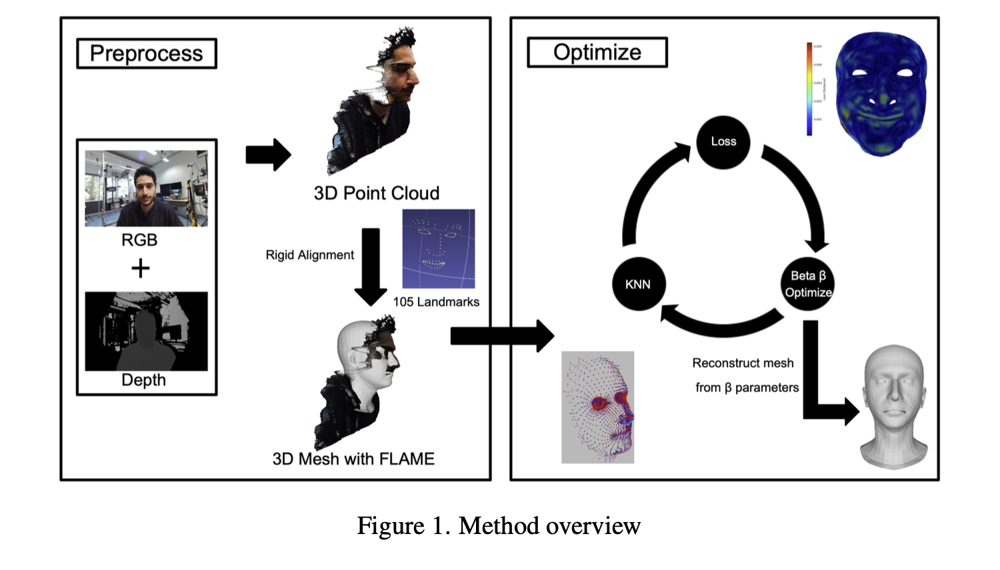

# 3D Shape Model Construction (3DSMC) Project

This project implements a 3D face reconstruction pipeline using the FLAME model for shape
modeling and optimization. RGB-D depth data is lifted into a 3D point cloud, matched against a
FLAME parametric face model via nearest-neighbor search, and fitted through Ceres-based
non-linear optimization (point-to-point and point-to-plane energy terms).

We use the docker env provided in the exercises.

> All source paths below are relative to the `Project/` subdirectory (e.g. `Lift_depth/Lift_depth.cpp`
> means `Project/Lift_depth/Lift_depth.cpp`) — see "Building the Project" for the `cd Project` step.

## Method Overview



- **Preprocess**: RGB + depth are lifted into a 3D point cloud (`lift_depth`), then rigidly
  aligned using 105 landmarks to produce an initial 3D mesh in the FLAME parametric space (`rt`).
- **Optimize**: the KNN → Loss → β-optimize loop (`optimize` / `optimize_face_only` /
  `optimize_plane`) repeatedly matches the current FLAME mesh against the target point cloud,
  computes a loss, and updates the shape parameters β, reconstructing the mesh from the updated β
  each iteration until convergence — this is the loop described in "Which optimizer" below.

## Project Structure

```
Project/
├── CMakeLists.txt          # Main build configuration
├── Eigen.h                 # Eigen convenience header
├── cnpy/                   # NumPy file I/O library (vendored, see "cnpy" below)
├── Data/                   # Input/output data directory (betas, KNN intermediates)
├── model/                  # FLAME model files — NOT checked into git, see "FLAME model" below
├── Lift_depth/              # Depth -> point cloud conversion
│   ├── Lift_depth.cpp      # builds the `lift_depth` executable
│   └── pixel_match.cpp     # depth/color pixel correspondence code — currently NOT wired
│                            # into CMakeLists.txt (no executable target), kept for reference
├── knn/                    # K-nearest-neighbor matching experiments
│   ├── knn_1.cpp           # brute-force KNN, unfiltered result + side-effect logging
│   ├── knn_2.cpp           # brute-force KNN with in-loop distance-threshold filtering
│   ├── knn_nanoflann.cpp   # KD-tree-accelerated KNN via the nanoflann library (standalone demo)
│   └── nanoflann.hpp       # vendored header-only KD-tree library
├── optimizer/               # FLAME shape-parameter optimization (see "Which optimizer" below)
│   ├── optimize.cpp             # point-to-point only, no region filtering
│   ├── optimize_face_only.cpp   # + face-region mask filtering
│   ├── optimize_plane.cpp       # + point-to-plane residual, dynamic weights (used by the pipeline)
│   ├── read_flame.cpp           # loads FLAME model, exports mesh as OBJ
│   └── write_obj.cpp            # OBJ export helper — currently NOT wired into CMakeLists.txt
├── RigidAlignment/
│   └── rt.cpp               # builds the `rt` executable (rigid alignment + landmark extraction)
├── build/                   # CMake build output directory (gitignored)
└── out/                     # Output directory
```

### cnpy

`Project/cnpy` used to be a git submodule pointing at [rogersce/cnpy](https://github.com/rogersce/cnpy),
but the repository never committed a `.gitmodules` file, so a fresh `git clone` left the directory
empty and **the project did not build**. The two source files (`cnpy.h`, `cnpy.cpp`, MIT-licensed,
attribution kept in `cnpy/LICENSE`) are now vendored directly instead of referenced as a submodule,
so `git clone` + `cmake` + `make` works out of the box.

### FLAME model

The `model/` directory (FLAME `.npz`/`.pkl` files) is intentionally excluded via `.gitignore`,
because redistributing the FLAME model files is not allowed under its license. To run anything
beyond a clean compile, register at <https://flame.is.tue.mpg.de/>, download the FLAME2023 model,
and place it under `model/FLAME2023/` following the paths referenced in each executable's `main()`.

## Dependencies

- **CMake** 3.10+
- **Eigen3** — linear algebra
- **OpenCV** — computer vision (used by `lift_depth`, `rt`)
- **Ceres Solver** — non-linear optimization (used by `optimize*`)
- **OpenMP** — parallel KNN search
- **ZLIB** — used by cnpy for `.npz` decompression

On macOS (Apple Clang has no built-in OpenMP support, so `libomp` is required separately):

```bash
brew install cmake eigen opencv ceres-solver libomp
```

On Ubuntu/Debian:

```bash
sudo apt install cmake libeigen3-dev libopencv-dev libceres-dev libomp-dev zlib1g-dev
```

## Building the Project

```bash
cd Project
mkdir -p build && cd build

# macOS + Apple Clang needs two extra flags so CMake's FindOpenMP can see Homebrew's libomp:
cmake .. -DCMAKE_BUILD_TYPE=Release \
         -DCMAKE_POLICY_DEFAULT_CMP0074=NEW \
         -DOpenMP_ROOT=$(brew --prefix libomp)

# Linux (OpenMP is usually found automatically):
# cmake .. -DCMAKE_BUILD_TYPE=Release

make -j4
```

This produces 8 executables: `lift_depth`, `rt`, `knn1`, `knn2`, `optimize`, `optimize_face_only`,
`optimize_plane`, `read_flame`.

## Executables

Listed roughly in pipeline order:

### 1. `lift_depth`
**Source**: `Lift_depth/Lift_depth.cpp`
Reads depth images and camera intrinsics/extrinsics, converts depth to a 3D point cloud, exports
as a COFF mesh file.

### 2. `rt`
**Source**: `RigidAlignment/rt.cpp`
Processes depth and color images together, extracts 3D landmarks from depth using 2D MediaPipe
landmarks, transforms coordinates between the depth and color cameras, exports the processed mesh
and 3D landmarks.
- Edit the `frame` variable in the source (e.g. `std::string frame = "00001"`) to point at a
  different capture, then rebuild.

### 3. `knn1` / `knn2` / `knn_nanoflann` (standalone experiments, not wired into CMakeLists)
**Source**: `knn/knn_1.cpp`, `knn/knn_2.cpp`, `knn/knn_nanoflann.cpp`
Three variants explored during development:
- `knn1`: brute-force nearest neighbor, no filtering, logs matched pairs to disk as a side effect.
- `knn2`: brute-force nearest neighbor with an in-loop distance threshold (invalid matches marked `-1`).
- `knn_nanoflann.cpp`: a KD-tree-accelerated version using [nanoflann](https://github.com/jlblancoc/nanoflann)
  for when brute-force KNN becomes the bottleneck on larger meshes. Not currently registered as a
  CMake target — add an `add_executable` entry if you want to build it.

### Which optimizer: `optimize` vs `optimize_face_only` vs `optimize_plane`
These three evolved iteratively during development (each file carries its own copy of the shared
KNN/Ceres helper code rather than sharing a common header — see "Known duplication" below):
- **`optimize`**: baseline — point-to-point residual only, no region filtering, 10 iterations.
- **`optimize_face_only`**: adds a face-region mask (`face_mask.npz`) so only face-area vertices
  (not neck/ears) participate in the fit.
- **`optimize_plane`**: the version actually used in the pipeline. Adds a point-to-plane residual
  (needs per-vertex normals, computed in `calculateNormals()`), weights that grow across
  iterations, a shrinking regularization term, and 7 iterations by default.
  - Set the `file_number` variable near the top of `main()` to match your input frame.

### `read_flame`
**Source**: `optimizer/read_flame.cpp`
Loads a FLAME model from NPZ files, generates a random or specific face shape, exports the
resulting mesh as OBJ. Supports both FLAME2020 and FLAME2023. Set `file_number` to load a specific
optimized result; output goes to `model/mesh/<frame>`.

### Not currently built
`Lift_depth/pixel_match.cpp` and `optimizer/write_obj.cpp` exist in the tree but have no
`add_executable` entry in `CMakeLists.txt`. `write_obj.cpp`'s `save_obj()` helper is what
`read_flame.cpp` actually uses for OBJ export (it's `#include`d there rather than compiled
separately) — `pixel_match.cpp` looks like earlier depth/color correspondence work that predates
`rt.cpp`. Neither blocks the documented pipeline; wire them in if you need them.

## Usage Pipeline

1. **Depth processing** — run `lift_depth` to convert depth to a 3D point cloud.
2. **Landmark extraction** — run `rt` to process depth/color and extract 3D landmarks.
3. **Shape optimization** — run `optimize_plane` for the full point-to-point + point-to-plane fit
   (or `optimize` / `optimize_face_only` for the earlier, simpler variants).
4. **Export** — run `read_flame` to generate and export the final mesh as OBJ.

## Known duplication (documented, not yet refactored)

`optimizer/optimize.cpp`, `optimizer/optimize_face_only.cpp`, `optimizer/optimize_plane.cpp`,
`knn/knn_1.cpp` and `knn/knn_2.cpp` each carry their own copy of `load_off_as_matrix`,
`apply_shape_blendshape`, `knn_search_parallel`, `KNN_Result`/`Flame_Mesh`, and (in the optimizer
files) the Ceres residual structs (`RegularizationCost`, `P2PointResidual`, `P2PlaneResidual`) —
roughly 200–230 near-identical lines repeated across all five files. There's also a
`save_matrix_as_txt` copy pasted into all three `optimizer/*.cpp` files whose one call site is
commented out in each, i.e. genuinely dead code.

This was pulled out into a shared `common/shared_utils.h` header in an earlier pass, but that
refactor was reverted at the repo owner's request — the numeric optimization logic couldn't be
run against real FLAME data on the machine doing the refactor (the model files are
license-restricted and weren't available there), so there was no way to actually confirm the
mechanically-transformed code produced bit-identical output rather than just "looks equivalent
on inspection". Rather than ship an unverified change to code that computes real geometry, the
three `optimizer/*.cpp` and two `knn/*.cpp` files were left exactly as they were.

If you want to dedupe this yourself with the ability to test against real data: `knn_2.cpp`'s
distance-thresholded KNN search and `knn_1.cpp`'s own KNN driver (which returns unfiltered
source/target matrices alongside a separately-filtered `flame_indices` list — a pre-existing
mismatch, not something introduced here) both have genuinely different behavior from the other
three files' shared KNN logic, so don't fold everything into one function without checking each
one's actual semantics first.

## Notes

- **Parallel processing**: KNN and optimization use OpenMP for parallel execution.
- **Memory usage**: large point clouds can make brute-force KNN memory- and time-hungry; see
  `knn_nanoflann.cpp` for a KD-tree alternative.
- **File formats**: OFF/COFF, OBJ, and NPZ.

## Troubleshooting

- `find_package(OpenMP)` fails on macOS → install `libomp` via Homebrew and pass
  `-DCMAKE_POLICY_DEFAULT_CMP0074=NEW -DOpenMP_ROOT=$(brew --prefix libomp)` to `cmake` (see
  "Building the Project" above).
- `cnpy` target has "No SOURCES given" → you have an old checkout with the broken submodule
  reference; pull the latest version of this repo, which vendors `cnpy.h`/`cnpy.cpp` directly.
- Missing FLAME `.npz` files → see "FLAME model" above; these are never checked into this repo.
- Verify file paths in each executable's `main()` match your actual data layout before running.
